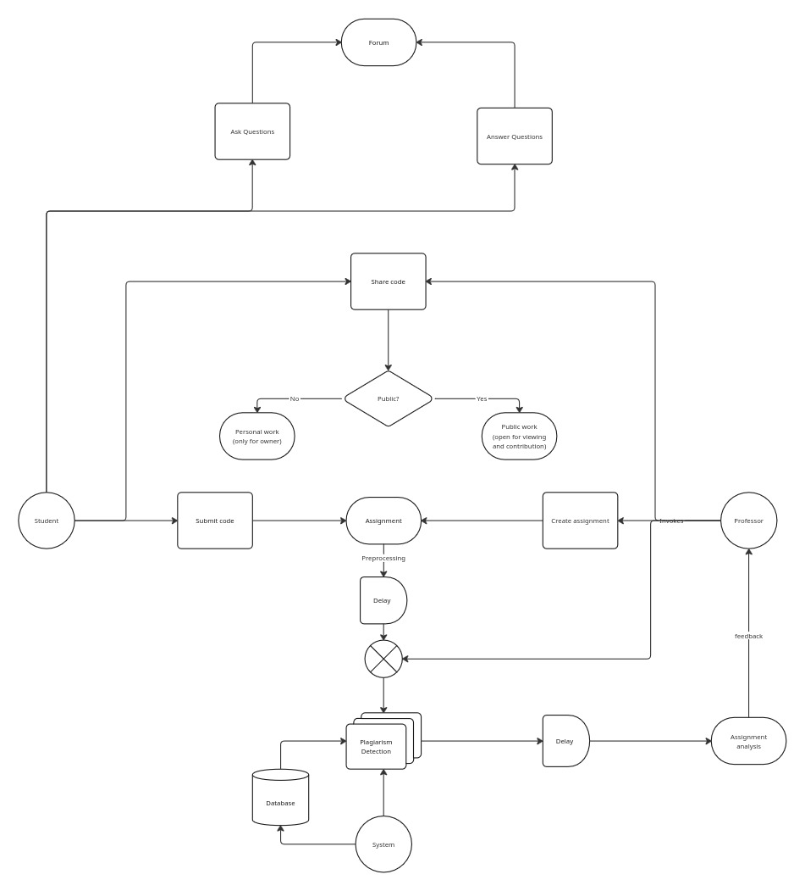

# ESIcodeHub

> Code sharing and plagiarism detection platform for ESI students and teachers

[]()
[]()
[]()

## 📋 Project Overview

ESIcodeHub is a comprehensive platform designed to facilitate code sharing, peer review, and plagiarism detection for computer science education at ESI. The system addresses the challenges of evaluating programming assignments in the age of AI-generated code while promoting transparent collaboration and academic integrity.

### Key Features

- 🔐 **User Authentication**: Role-based access (Student, Teacher, Admin)
- 📝 **Code Submission**: Multi-language support with syntax highlighting
- 👥 **Peer Review System**: Structured feedback with inline comments
- 🔍 **Plagiarism Detection**: AST-based code comparison
- 📊 **Dashboard & Analytics**: Progress tracking and statistics
- 📦 **Version Control**: Track code evolution (Optional)
- 💬 **Q&A Forum**: Programming discussion space (Optional)

## 🏗️ Architecture


## 🛠️ Tech Stack

### Frontend
- **Framework**: Next.js 14 (React 18, TypeScript)
- **Styling**: Tailwind CSS + shadcn/ui
- **Code Editor**: Monaco Editor
- **HTTP Client**: Axios
- **State Management**: Zustand

### Backend
- **Framework**: Django 6.0 + Django REST Framework
- **Language**: Python 3.12+
- **Database**: PostgreSQL 15+
- **Task Queue**: Celery + Redis
- **Authentication**: JWT (djangorestframework-simplejwt)

### DevOps
- **Containerization**: Docker + Docker Compose
- **Version Control**: Git + GitHub
- **CI/CD**: GitHub Actions

## 🚀 Quick Start

### Prerequisites

- Docker & Docker Compose
- Git
- Node.js 18+ (for local frontend development)
- Python 3.11+ (for local backend development)

### Installation

1. **Clone the repository**
```bash
   git clone https://github.com/P2CP25-050/esicodehub.git
   cd esicodehub
```

2. **Set up environment variables**
```bash
   # Backend
   cp backend/.env.example backend/.env
   
   # Frontend
   cp frontend/.env.example frontend/.env.local

   # Root
   cp .env.example .env

   # Generate a secret key and replace the generated value in both .env and backend/.env
    python -c "from django.core.management.utils import get_random_secret_key; print(get_random_secret_key())"
```

3. **Start with Docker Compose (Easiest)**
```bash
   docker compose up
```
   
   Access:
   - Frontend: http://localhost:3000
   - Backend API: http://localhost:8000
   - API Docs: http://localhost:8000/api/docs/

4. **Or run manually (Development)**
   
   **Backend:**
```bash
   cd backend
   python -m venv venv
   source venv/bin/activate  # On Windows: venv\Scripts\activate
   pip install -r requirements/dev.txt
   python manage.py migrate
   python manage.py createsuperuser
   python manage.py runserver
```
   
   **Frontend:**
```bash
   cd frontend
   npm install
   npm run dev
```
   
   **Celery Worker:**
```bash
   cd backend
   celery -A config worker --loglevel=info
```

## 📚 Documentation

- [Architecture Document](docs/architecture.md)
- [API Documentation](docs/api.md)
- [Database Schema](docs/database.md)
- [User Manual](docs/user-manual.md)
- [Installation Guide](docs/installation.md)
- [Contributing Guide](docs/CONTRIBUTING.md)

## 👥 Team

| Name                        | Role                    | Responsibilities                           |
|-----------------------------|-------------------------|--------------------------------------------|
| Dhia Eddine HOUAM           | Team Lead + Backend Dev | Architecture, Plagiarism Detection, DevOps |
| Mohamed Nour KESSAB         | Backend Developer       | Backend modules development, DB management |
| Abderrahmane Tayeb BOUDJEMA | Backend Developer       | Backend modules development, QA            |
| Nasr Allah RAHLI            | Frontend Developer      | UI/UX development                          |
| Houssam DJAIDJA             | Frontend Developer      | UI/UX design and development               |
| Anes BENDJELLOUL            | Frontend Developer      | Frontend API layer development             |

## 📝 Development Workflow

See [CONTRIBUTING.md](docs/CONTRIBUTING.md) for detailed workflow.

**Quick Summary:**
1. Create feature branch from `dev`
2. Work on your feature
3. Submit Pull Request
4. Get 1 approval
5. Merge to `dev`

## 🧪 Testing
```bash
# Backend tests
cd backend
source venv/bin/activate
python manage.py test --settings=config.settings.test

# Frontend tests
cd frontend
npm test

# E2E tests
npm run test:e2e
```

## 📄 License

This project is for educational purposes as part of PRJP course at ESI.

## 🙏 Acknowledgments

- **ESI** - École nationale Supérieure d'Informatique
- **Course**: PRJP - Projet Pluridisciplinaire
- **Academic Year**: 2025-2026

---

**Project PRJP11** | **2CP** | **ESI - 2026**
